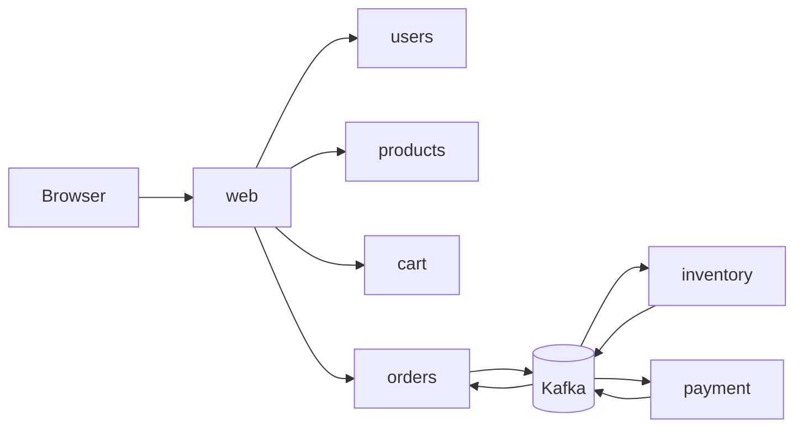
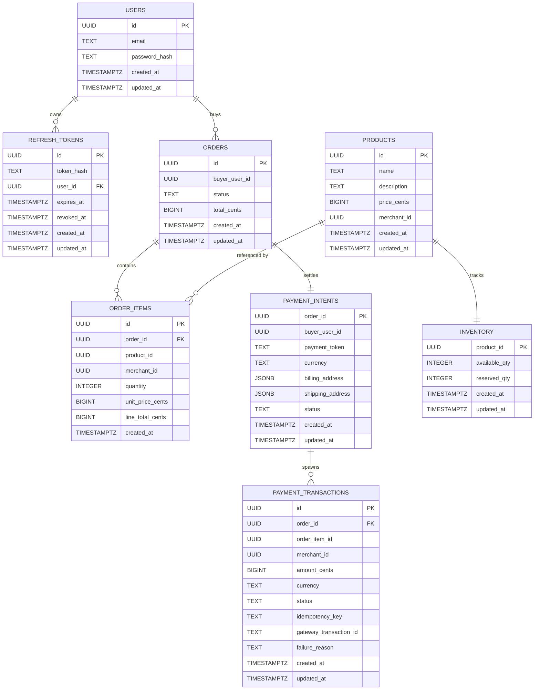

# Refurbished Marketplace

## Overview

The system models a marketplace for browsing products, managing carts, creating orders, coordinating inventory, and handling payment flows. Internal services communicate over gRPC. Domain events and eventual consistency workflows use Kafka, while each service owns its own persistence boundary.

## Architecture

### Service Boundaries

- `services/web` owns the public browser edge, auth boundary, server-rendered pages, and Datastar-compatible fragments.
- `services/users` owns users, credentials, access tokens, and refresh-token sessions.
- `services/products` owns product catalog data.
- `services/cart` owns ephemeral cart state.
- `services/orders` owns order creation, order state, and order outbox events.
- `services/inventory` owns inventory availability and reservation state.
- `services/payment` owns payment intents, payment transactions, and gateway webhook handling.
- `shared/proto` contains the protobuf contracts used by service clients and servers.

### System Flow



### Data Ownership

Each domain service owns its local database schema. Cross-service references are logical IDs, not shared foreign-key ownership. Redis/Valkey is used for ephemeral cart state.



## Tech Stack

- Go for all services and shared libraries.
- gRPC and Protocol Buffers for internal service APIs.
- PostgreSQL for service-local durable persistence, `sqlc` for queries generation and `goose` for migration
- Redis/Valkey for cart state.
- Kafka for asynchronous domain integration.
- `templ` for typed server-rendered HTML components.
- Datastar-compatible markup for browser interactions and fragment updates.
- Tilt, Helm, and Kubernetes manifests for local/runtime orchestration.
- Nix/devenv for local development environment setup.
- OpenSpec for change proposals, specs, designs, tasks, and archives.

## Development

This repository uses `devenv` to install and pin local tooling. Enter the development shell before running generators, tests, or local infrastructure commands:

```bash
devenv shell
```

The shell provides the project tooling defined in `devenv.nix`, such as Go, protobuf tooling, database migration/query generators, Kubernetes tooling, and related CLIs. Prefer adding new required developer tools to `devenv.nix` instead of relying on globally installed binaries.

Local Kubernetes development is managed with Tilt. After entering the `devenv` shell, start the stack with:

```bash
tilt up
```

Tilt uses the root `Tiltfile` to build services, apply the Kubernetes/Helm resources under `infra/`, and keep the local cluster in sync while you edit code. Use the Tilt UI to inspect service status, logs, resource readiness, and rebuilds.

### Repository Layout

- `services/<name>/`: service implementations.
- `shared/`: shared Go modules and protobuf contracts.
- `infra/`: deployment and infrastructure configuration.
- `openspec/`: active and archived change artifacts.
- `docs/`: project documentation.
