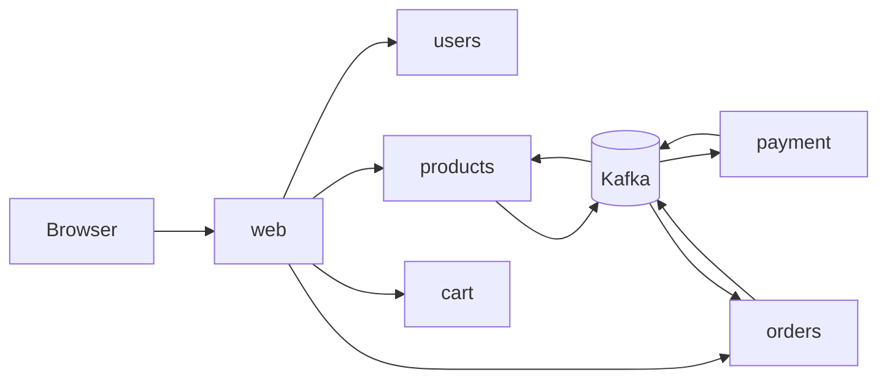

# Refurbished Marketplace

## Overview

This repository is a learning project for building distributed, highly available microservices in Go around an ecommerce domain.

## Architecture

### Service Boundaries

| Service             | Responsibility               | Notes                                              |
| ------------------- | ---------------------------- | -------------------------------------------------- |
| `services/web`      | Browser edge and SSR pages   | `templ`, Datastar fragments, internal gRPC clients |
| `services/users`    | Identity and sessions        | JWT auth, refresh tokens, PostgreSQL               |
| `services/products` | Catalog, stock, reservations | gRPC, PostgreSQL, SQLC, Kafka consumers            |
| `services/cart`     | Ephemeral carts              | Redis/Valkey-backed state                          |
| `services/orders`   | Order lifecycle              | Merchant-scoped, PostgreSQL, outbox/Kafka          |
| `services/payment`  | Payment flows                | Gateway integration, Kafka event handling          |

### System Flow



## Tech Stack

- Go for all services and shared libraries.
- gRPC and Protocol Buffers for internal service APIs.
- PostgreSQL for service-local durable persistence, `sqlc` for queries generation and `goose` for schema migration
- Redis/Valkey for cart state.
- Kafka for asynchronous domain integration.
- `templ` for typed server-rendered HTML components.
- Datastar-compatible markup for browser interactions and fragment updates.
- Tilt, Helm, and Kubernetes manifests for local/runtime orchestration.
- Nix/devenv for local development environment setup.
- OpenSpec for change proposals, specs, designs, tasks, and archives.

## Development

This repository uses `devenv` to install and pin local tooling. Enter the development shell before running generators, tests, or local infrastructure commands:

```bash
devenv shell
```

The shell provides the project tooling defined in `devenv.nix`, such as Go, protobuf tooling, database migration/query generators, Kubernetes tooling, and related CLIs.

Integration tests rely on Testcontainers for Kafka, PostgreSQL, and Redis/Valkey.

Local Kubernetes development is managed with Tilt. After entering the `devenv` shell, start the stack with:

```bash
tilt up
```

Tilt uses the root `Tiltfile` to build services, apply the Kubernetes/Helm resources under `infra/`, and keep the local cluster in sync while you edit code. Use the Tilt UI to inspect service status, logs, resource readiness, and rebuilds.
