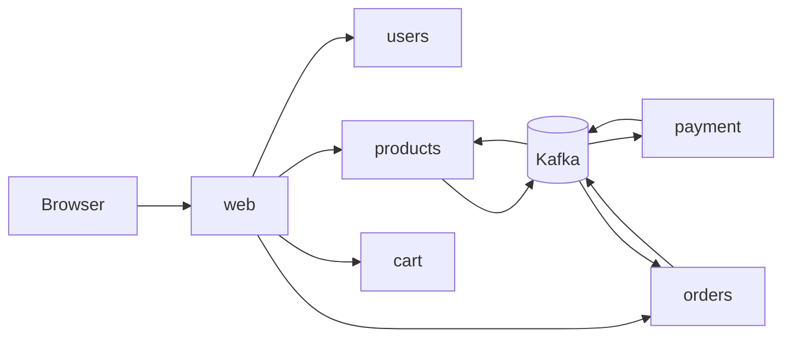

# Refurbished Marketplace

## Overview

This repository is a learning project for building distributed, highly available microservices in Go around an ecommerce domain.

## Architecture

### Service Boundaries

| Service             | Responsibility               | Notes                                              |
| ------------------- | ---------------------------- | -------------------------------------------------- |
| `services/web`      | Browser edge and SSR pages   | `templ`, Datastar fragments, internal gRPC clients |
| `services/users`    | Identity and sessions        | JWT auth, refresh tokens, PostgreSQL               |
| `services/products` | Catalog, stock, reservations | gRPC, PostgreSQL, SQLC, Kafka consumers            |
| `services/cart`     | Ephemeral carts              | Redis/Valkey-backed state                          |
| `services/orders`   | Order lifecycle              | Merchant-scoped, PostgreSQL, outbox/Kafka          |
| `services/payment`  | Payment flows                | Gateway integration, Kafka event handling          |

### System Flow



## Tech Stack

- Go for all services and shared libraries.
- gRPC and Protocol Buffers for internal service APIs.
- PostgreSQL for service-local durable persistence, `sqlc` for query generation and `goose` for schema migration.
- Redis/Valkey for cart state.
- Kafka for asynchronous domain integration.
- `templ` for typed server-rendered HTML components.
- Datastar-compatible markup for browser interactions and fragment updates.
- Kubernetes + Helm (CloudNativePG, Strimzi, Istio ambient, External Secrets).
- Local DX: Tilt for the marketplace chart + image builds; Argo CD (`infra/argocd/local/`) for operators, Istio, Kafka, observability, and Cloudflare Tunnel. Staging uses full Argo (`infra/argocd/staging/`).
- Cloudflare Tunnel to Istio Gateway for browser ingress (`.dev` hosts locally, production hosts in staging).
- Nix/devenv for local tooling (`tilt`, codegen); OpenSpec for change proposals.

## Development

See [CONTRIBUTING.md](CONTRIBUTING.md) and [docs/development/](docs/development/) for the local workflow (`devenv`, Tilt + Argo on Colima, secrets, code generation), OpenSpec planning, and GitHub issue conventions.

Quick start:

```bash
devenv shell
tilt up
# https://shop.dev.phuchoang.sbs
```
