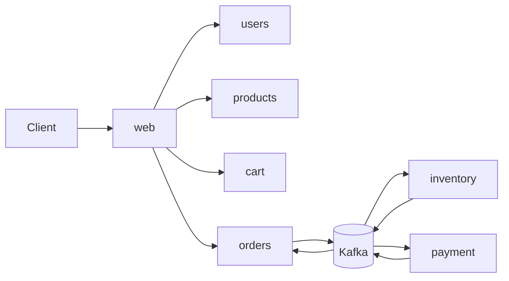
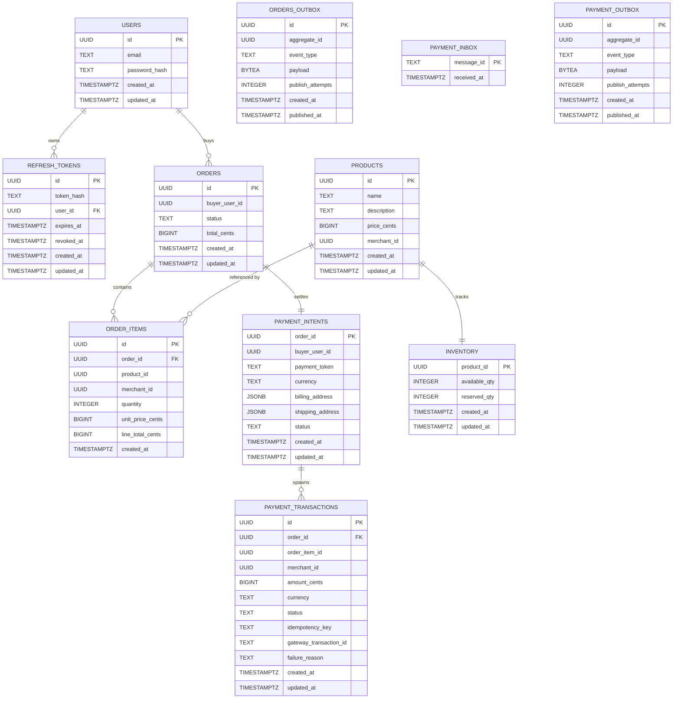

# Repository Architecture

This repository is a multi-module Go workspace for a multi-service marketplace.

## Boundaries

- `web` owns the public REST edge.
- Internal services use gRPC.
- Kafka handles async integration between domain services.
- PostgreSQL owns service-local persistence.
- Redis/Valkey powers the ephemeral cart.

## Runtime Layout

- Go services are kept under `services/<name>/`.
- Shared protobuf contracts live under `shared/proto/<domain>/v1/`.
- Local development is managed with `devenv.nix`, plus Tilt and Helm for the Kubernetes stack.

## System Flow

## Database ERD

The diagram below reflects the tables created by each service migration. Some cross-service links are logical IDs rather than enforced foreign keys because each service owns its own database.

