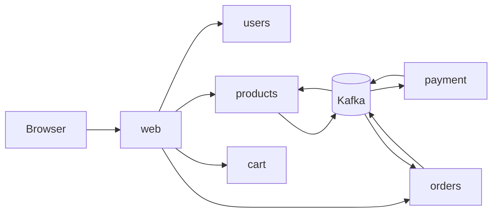

# Refurbished Marketplace

## Overview

This repository is a learning project for building distributed, highly available microservices in Go around an ecommerce domain.

## Architecture

### Service Boundaries

| Service             | Responsibility               | Notes                                              |
| ------------------- | ---------------------------- | -------------------------------------------------- |
| `services/web`      | Browser edge and SSR pages   | `templ`, Datastar fragments, internal gRPC clients |
| `services/users`    | Identity and sessions        | JWT auth, refresh tokens, PostgreSQL               |
| `services/products` | Catalog, stock, reservations | gRPC, PostgreSQL, SQLC, Kafka consumers            |
| `services/cart`     | Ephemeral carts              | Redis/Valkey-backed state                          |
| `services/orders`   | Order lifecycle              | Merchant-scoped, PostgreSQL, outbox/Kafka          |
| `services/payment`  | Payment flows                | Gateway integration, Kafka event handling          |

### System Flow


```mermaid
graph LR
  Browser[Browser] --> Web[web]
  Web --> Users[users]
  Web --> Products[products]
  Web --> Cart[cart]
  Web --> Orders[orders]
  Orders --> Kafka[(Kafka)]
  Kafka --> Products[products]
  Kafka --> Payment[payment]
  Kafka --> Orders
  Payment --> Kafka
  Products --> Kafka
```

## Tech Stack

- Go for all services and shared libraries.
- gRPC and Protocol Buffers for internal service APIs.
- PostgreSQL for service-local durable persistence, `sqlc` for query generation and `goose` for schema migration.
- Redis/Valkey for cart state.
- Kafka for asynchronous domain integration.
- `templ` for typed server-rendered HTML components.
- Datastar-compatible markup for browser interactions and fragment updates.
- Kubernetes + Helm (CloudNativePG, Strimzi, Cilium Gateway API, External Secrets).
- GitOps: Argo CD on Talos (`dev-root` / `prod-root` → shared `app-of-apps`); images from GHCR.
- Cloudflare Tunnel to Cilium Gateway for browser ingress.
- Nix/devenv for local tooling (codegen); OpenSpec for change proposals.

## Development

See [CONTRIBUTING.md](CONTRIBUTING.md) and [docs/development/](docs/development/) for devenv, Argo on gpu, secrets, and OpenSpec.

Quick start:

```bash
devenv shell
export KUBECONFIG="$HOME/.kube/talos-dev.yaml"
kubectl apply -f infra/k8s/doppler-token.dev.secret.yaml
export KUBECONFIG="$HOME/.kube/talos-gpu.yaml"
kubectl apply -f infra/argocd/dev/root.yaml
# https://shop-dev.phuchoang.sbs
```
