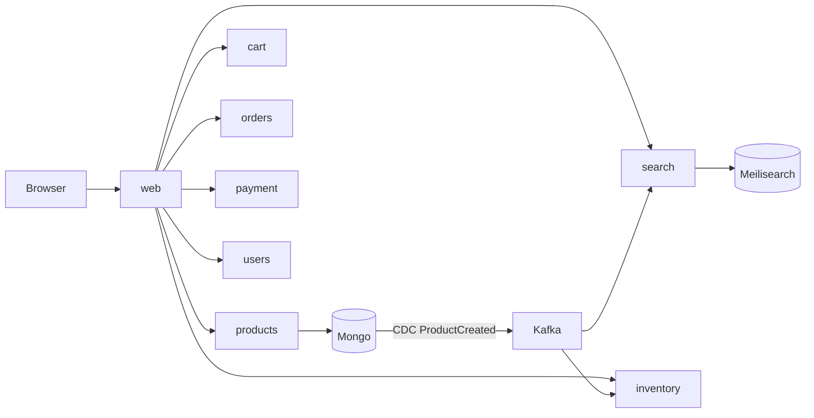

# Refurbished Marketplace

Learning project for distributed Go services around a refurbished-goods marketplace: server-rendered shop, merchant-scoped checkout, and GitOps on Talos.

## Architecture

Eight marketplace processes plus a hosted-payment simulator. Catalog identity is Mongo, live stock is inventory Postgres, browse/search is Meilisearch.

| Service              | Responsibility                | Notes                                              |
| -------------------- | ----------------------------- | -------------------------------------------------- |
| `services/web`       | Browser edge and SSR          | `templ`, Datastar fragments, internal gRPC clients |
| `services/users`     | Identity and sessions         | JWT, refresh tokens, PostgreSQL                    |
| `services/products`  | Listing identity              | Mongo `catalog` listings + outbox; no stock        |
| `services/search`    | Storefront catalog read model | Kafka → Meilisearch; `SearchProducts`              |
| `services/inventory` | Stock and reservations        | PostgreSQL, `ReserveStock`, Kafka consumers        |
| `services/cart`      | Ephemeral carts               | Redis/Valkey; merchant + name/price snapshots      |
| `services/orders`    | Order lifecycle               | Merchant-scoped PostgreSQL, outbox/Kafka           |
| `services/payment`   | Hosted payment sessions       | Gateway callbacks, Kafka outcomes                  |


```mermaid
flowchart LR
  browser["Browser"]
  web["web"]
  products["products"]
  search["search"]
  inventory["inventory"]
  cart["cart"]
  orders["orders"]
  payment["payment"]
  users["users"]
  mongo[("Mongo")]
  meili[("Meilisearch")]
  kafka["Kafka"]

  browser --> web
  web --> users
  web --> products
  web --> search
  web --> inventory
  web --> cart
  web --> orders
  web --> payment
  products --> mongo
  mongo -->|"CDC ProductCreated"| kafka
  kafka --> inventory
  kafka --> search
  search --> meili
```

Full topology, ports, and GitOps: [docs/architecture.md](docs/architecture.md). Catalog vs stock vs search: [docs/catalog-inventory-search.md](docs/catalog-inventory-search.md). Checkout: [docs/order-placement.md](docs/order-placement.md).

## Tech stack

- Go services and shared libraries (`go.work`).
- gRPC / Protocol Buffers for internal APIs (`shared/proto`).
- PostgreSQL + `sqlc` + `goose` for users, inventory, orders, payment.
- MongoDB Community (MCK) for catalog documents and the products outbox.
- Meilisearch for browse/text search (projection only).
- Redis/Valkey for cart state.
- Kafka (Strimzi) + Debezium outbox (Postgres and Mongo).
- `templ` + Datastar for server-rendered HTML.
- Kubernetes / Helm: CloudNativePG, Strimzi, MCK, Cilium Gateway API, External Secrets.
- GitOps: Argo CD on Talos gpu (`dev-root` / `prod-root` → app-of-apps); images from GHCR.
- Cloudflare Tunnel to Cilium Gateway for shop, pay, and Grafana.
- Nix/devenv for local tooling; OpenSpec for change proposals.

## Development

See [CONTRIBUTING.md](CONTRIBUTING.md) and [docs/](docs/).

```bash
devenv shell
export KUBECONFIG="$HOME/.kube/talos-dev.yaml"
kubectl apply -f infra/k8s/doppler-token.dev.secret.yaml
export KUBECONFIG="$HOME/.kube/talos-gpu.yaml"
kubectl apply -f infra/argocd/dev/root.yaml
# https://shop-dev.phuchoang.sbs
```
