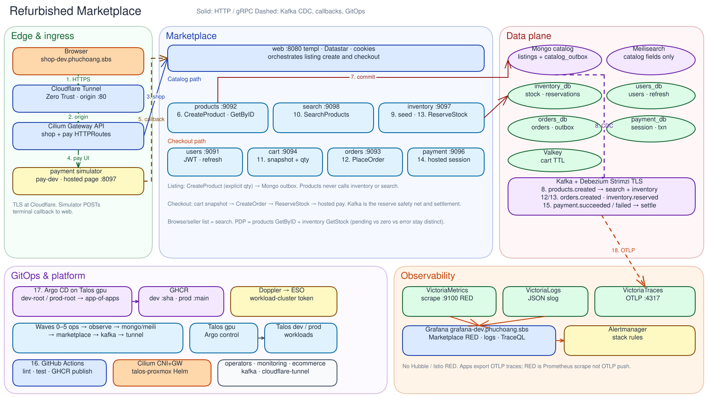

# Architecture

Go marketplace services behind a server-rendered web edge. Browser traffic never talks to domain gRPC; `web` is the only public HTTP surface besides the hosted-payment simulator.

## Service boundaries

| Service                           | Responsibility                                                                        | Persistence                                      | Internal API                                  |
| --------------------------------- | ------------------------------------------------------------------------------------- | ------------------------------------------------ | --------------------------------------------- |
| `services/web`                    | Browser edge: `templ` pages, Datastar fragments, auth cookies, checkout orchestration | none (stateless)                                 | HTTP 8080; gRPC client to all domain services |
| `services/users`                  | Identity, JWT access tokens, refresh sessions                                         | Postgres (`users_db`)                            | gRPC 9091                                     |
| `services/products`               | Listing identity and catalog fields; ProductCreated outbox                            | MongoDB `catalog` (`listings`, `catalog_outbox`) | gRPC 9092                                     |
| `services/search`                 | Storefront catalog projection; `SearchProducts`                                       | Meilisearch (not source of truth)                | gRPC 9098                                     |
| `services/inventory`              | Available/reserved quantity, reservations, stock seed from ProductCreated             | Postgres (`inventory_db`)                        | gRPC 9097                                     |
| `services/cart`                   | Ephemeral carts with merchant + display snapshots                                     | Redis/Valkey (in-pod)                            | gRPC 9094                                     |
| `services/orders`                 | Merchant-scoped orders and `orders.created` outbox                                    | Postgres (`orders_db`)                           | gRPC 9093                                     |
| `services/payment`                | Hosted payment sessions, one transaction per order, payment outbox                    | Postgres (`payment_db`)                          | gRPC 9096                                     |
| `tools/payment-gateway-simulator` | Dev/prod-in-cluster mock hosted page                                                  | none                                             | HTTP 8097                                     |

## Runtime topology

Editable source: [diagrams/architecture.excalidraw](diagrams/architecture.excalidraw).

East-west calls are ClusterIP plus CiliumNetworkPolicy (optional required mTLS). Kafka uses Strimzi TLS, not mesh mTLS. Mongo `27017` and Meilisearch `7700` are allow-listed without SPIRE.

## Catalog write vs read

1. Seller create: `web` → products `CreateProduct` (explicit initial quantity). Products commits listing + `catalog_outbox` in one replica-set transaction.
2. Debezium Mongo publishes `products.created`.
3. Inventory consumer group `inventory-product-created` seeds stock.
4. Search consumer group `search-product-created` upserts catalog fields in Meilisearch.
5. Browse/seller list: `web` → search `SearchProducts`. Product detail: products `GetProductByID` + inventory `GetStock`. Checkout prices: products `GetProductsByIDs`. Hold: inventory `ReserveStock`.

Details: [catalog-inventory-search.md](catalog-inventory-search.md).

## Checkout

`web` places a merchant-scoped order, then calls inventory `ReserveStock` before creating a hosted payment session. Kafka `orders.created` is a safety net if gRPC already held stock. Payment outcomes flow `payment.succeeded` / `payment.failed` to inventory (commit/release) and orders (paid/failed).

Details: [order-placement.md](order-placement.md).

## Platform

| Layer    | Where                                                                                                               |
| -------- | ------------------------------------------------------------------------------------------------------------------- |
| Clusters | Talos **dev** / **prod** run workloads; Argo CD is on **gpu**                                                       |
| GitOps   | `infra/argocd/dev/root.yaml` and `prod/root.yaml` → shared app-of-apps                                              |
| Images   | GHCR `ghcr.io/phuchoang2603/refurbished-marketplace/<name>:<sha>` (dev) or `:main` (prod)                           |
| Secrets  | Doppler → External Secrets; token Secret on the workload cluster                                                    |
| Ingress  | Cloudflare Tunnel → Cilium Gateway API (`gatewayClassName: cilium`)                                                 |
| Observe  | VictoriaMetrics / VictoriaLogs / VictoriaTraces in `monitoring`; apps scrape `:9100/metrics` and export OTLP traces |

See [deployment/gitops.md](deployment/gitops.md), [deployment/cilium.md](deployment/cilium.md), and [deployment/observability.md](deployment/observability.md).
