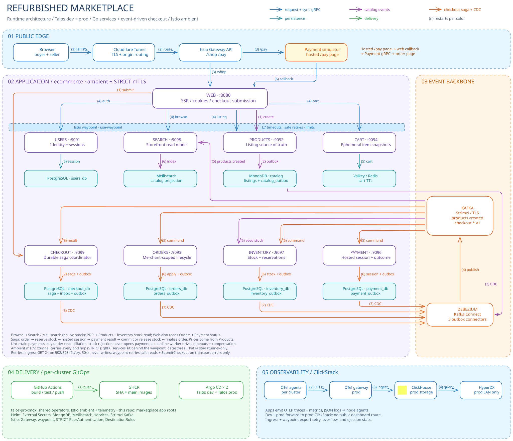

# Architecture

Go marketplace services behind a server-rendered web edge. Browser traffic never talks to domain gRPC; `web` is the only public HTTP surface besides the hosted-payment simulator.

## Service boundaries

| Service                           | Responsibility                                                                                  | Persistence                                      | Internal API                                  |
| --------------------------------- | ----------------------------------------------------------------------------------------------- | ------------------------------------------------ | --------------------------------------------- |
| `services/web`                    | Browser edge: `templ` pages, Datastar fragments, auth cookies, checkout submission and progress | none (stateless)                                 | HTTP 8080; gRPC client to all domain services |
| `services/users`                  | Identity, JWT access tokens, refresh sessions                                                   | Postgres (`users_db`)                            | gRPC 9091                                     |
| `services/products`               | Listing identity and catalog fields; ProductCreated outbox                                      | MongoDB `catalog` (`listings`, `catalog_outbox`) | gRPC 9092                                     |
| `services/search`                 | Storefront catalog projection; `SearchProducts`                                                 | Meilisearch (not source of truth)                | gRPC 9098                                     |
| `services/inventory`              | Available/reserved quantity, reservations, stock seed from ProductCreated                       | Postgres (`inventory_db`)                        | gRPC 9097                                     |
| `services/cart`                   | Ephemeral carts with merchant + display snapshots                                               | Redis/Valkey (in-pod)                            | gRPC 9094                                     |
| `services/checkout`               | Durable checkout saga, command/result inbox and outbox, recovery                                | Postgres (`checkout_db`)                         | gRPC 9099                                     |
| `services/orders`                 | Merchant-scoped orders and checkout command/results                                             | Postgres (`orders_db`)                           | gRPC 9093                                     |
| `services/payment`                | Hosted payment sessions, one transaction per order, checkout results                            | Postgres (`payment_db`)                          | gRPC 9096                                     |
| `tools/payment-gateway-simulator` | Dev/prod-in-cluster mock hosted page                                                            | none                                             | HTTP 8097                                     |

## Runtime topology

Editable source: [diagrams/architecture.excalidraw](diagrams/architecture.excalidraw).

`ecommerce` and `kafka` are enrolled in Istio ambient with `STRICT` mTLS, so all east-west traffic, including Kafka Connect → Mongo and Search → Meilisearch, is mutually authenticated by ztunnel. Domain gRPC Services also route through a service waypoint for connection limits, retry budgets, and outlier handling; Kafka and data stores stay ztunnel-only. Kafka keeps its own Strimzi TLS. Proxy retries are opt-in for replay-safe operations only and never replace the checkout saga's durable recovery.

## Catalog write vs read

1. Seller create: `web` → products `CreateProduct` (explicit initial quantity). Products commits listing + `catalog_outbox` in one replica-set transaction.
2. Debezium Mongo publishes `products.created`.
3. Inventory consumer group `inventory-product-created` seeds stock.
4. Search consumer group `search-product-created` upserts catalog fields in Meilisearch.
5. Browse/seller list: `web` → search `SearchProducts`. Product detail: products `GetProductByID` + inventory `GetStock`. Checkout prices: products `GetProductsByIDs`. Checkout commands Inventory to reserve stock asynchronously.

Details: [catalog-inventory-search.md](catalog-inventory-search.md).

## Checkout

`web` submits one validated merchant-scoped snapshot to Checkout and shows buyer-scoped progress. Checkout persists the saga, then commands Orders to create a pending order, Inventory to reserve stock, and Payment to create a hosted session. The buyer is redirected only when stock and session are ready. Payment outcomes return to Checkout; it waits for Inventory commit/release acknowledgement before finalizing Orders. Debezium and Kafka deliver versioned `checkout.*.v1` commands/results through service-local inboxes and outboxes. Existing legacy data is retained but not migrated into Checkout.

Details: [order-placement.md](order-placement.md).

## Platform

| Layer    | Where                                                                                                             |
| -------- | ----------------------------------------------------------------------------------------------------------------- |
| Clusters | Talos **dev** / **prod** run workloads; each runs its own Argo CD in `argo-cd`                                    |
| GitOps   | `talos-proxmox` `platform` root installs shared operators; this repo's roots deploy application consumers locally |
| Images   | GHCR `ghcr.io/phuchoang2603/refurbished-marketplace/<name>:<sha>` (dev) or `:main` (prod)                         |
| Secrets  | Doppler → External Secrets; `ecommerce/doppler-token` applied per environment                                     |
| Ingress  | Cloudflare Tunnel → Istio Gateway API (`gatewayClassName: istio`)                                                 |
| Network  | Cilium CNI and Istio ambient (ztunnel, waypoint) installed by `talos-proxmox`                                     |
| Observe  | Apps export OTLP traces and metrics to `otel-agent` and log JSON to stdout; ClickHouse + HyperDX on prod          |

Each cluster's Argo CD runs its own marketplace root alongside the platform root. The platform supplies operators and the telemetry pipeline; the marketplace root creates the ambient-enrolled `ecommerce` and `kafka` namespaces (wave 0), then submits `secret-store` (wave 1), MongoDB and Meilisearch (2), services (3), then Kafka (4). These waves do not wait for child health: children retry while platform dependencies converge. The per-cluster `otel-agent` forwards both dev and prod telemetry to ClickHouse and HyperDX on prod.

See [deployment/gitops.md](deployment/gitops.md), [deployment/networking.md](deployment/networking.md), and [deployment/observability.md](deployment/observability.md).
