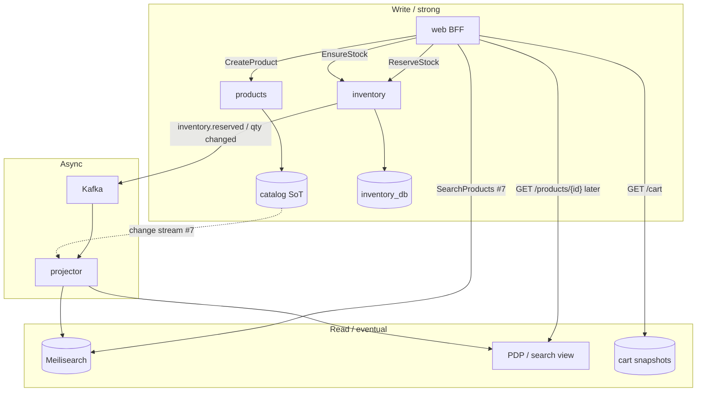
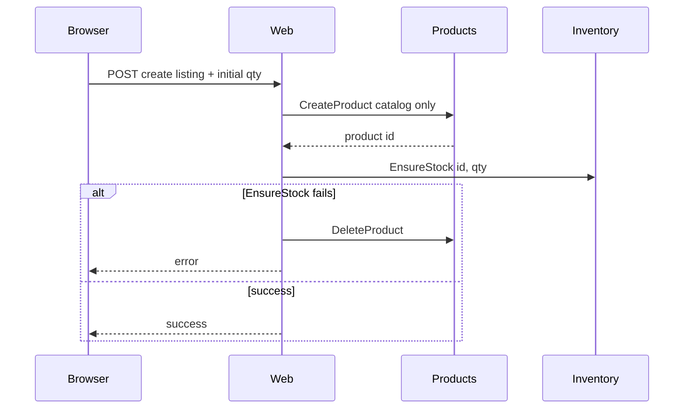
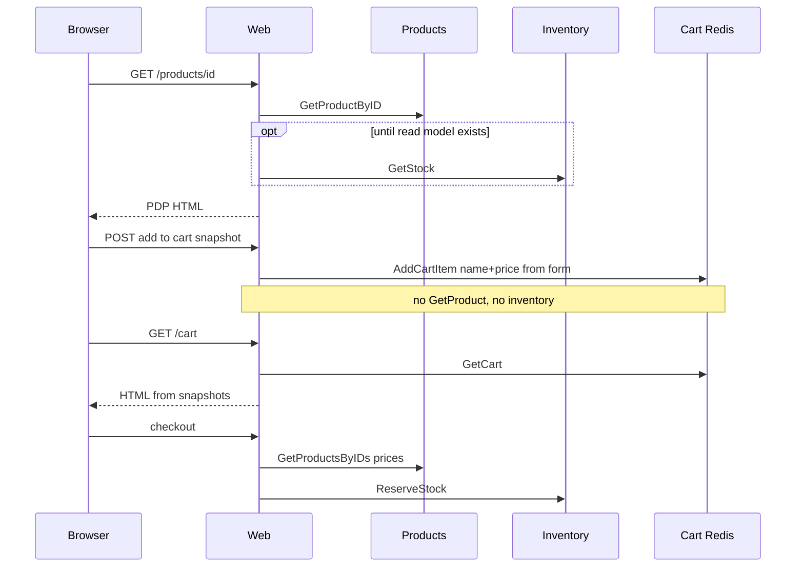

# Catalog, Inventory, And Search

How listings, stock, and storefront search relate after inventory is its own runtime. Meilisearch (#7) is the list/search projection; it is not source of truth.

## Stores

| Store                            | Owns                                                                | Readers                                   |
| -------------------------------- | ------------------------------------------------------------------- | ----------------------------------------- |
| Products (SQL now, Mongo in #57) | Listing document: name, description, price, merchant                | Web Get*, checkout price re-validation    |
| Inventory Postgres               | `available_qty`, `reserved_qty`, reservations, outbox               | Web EnsureStock / GetStock / ReserveStock |
| Cart Redis                       | Line snapshots (name, unit price, qty of _items_)                   | Cart GET                                  |
| Meilisearch (#7)                 | Search/list projection of listings (+ optional coarse availability) | Storefront browse/search                  |

Products **never** gRPC inventory.

## Target read model (scale)

Inventory write-DB stays authoritative for checkout. After qty changes, an `InventoryUpdated` (or existing inventory outbox) event updates a **read-optimized** product view (Mongo listing field and/or Meili). The product page and search read that view. Checkout still calls inventory `ReserveStock`.

Until that projector exists, web MAY `GetStock` **once** on the product detail page. Add-to-cart copies the PDP snapshot (name, price). Cart HTML does not call products or inventory per line.

## Create listing

## View, cart, checkout

## Meilisearch (#7, not this extract)

- Index from **Mongo listing** change stream (after #57), not from Postgres `products`.
- Optional: same projector applies `InventoryUpdated` as `in_stock` / `low` / `out` (not the reservation ledger).
- `ListProducts` SQL OFFSET goes away; browse stays dark until this lands.

## What not to do

- Products calling inventory on Get* or Create.
- Treating Meili or the PDP cache as stock SoT at checkout.
- Kafka between CreateProduct and EnsureStock (seller create stays sync in web).
