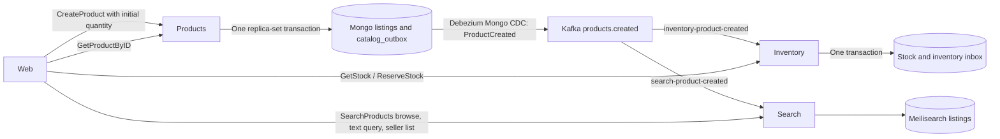
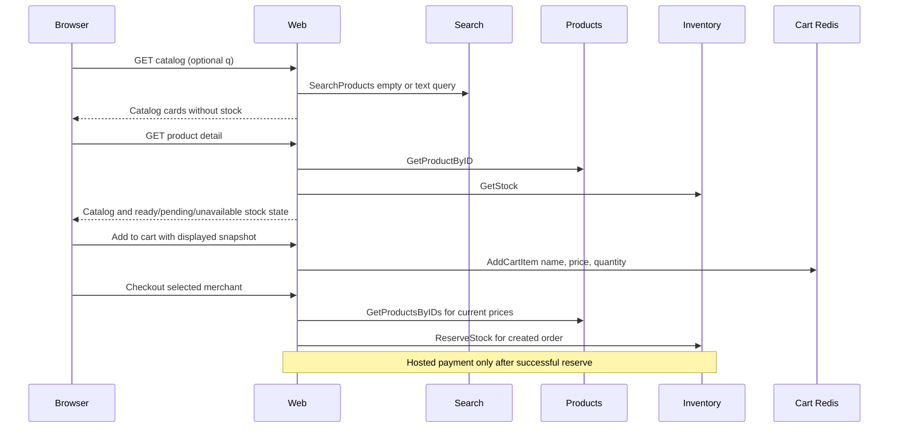

# Catalog, Inventory, and Search

Products persists listings and a ProductCreated outbox document in MongoDB; Debezium Mongo CDC publishes `products.created`. Inventory consumes that topic in `inventory-product-created`. Search consumes the same topic in `search-product-created` and upserts catalog fields into Meilisearch. The two consumer groups are independent.

## Ownership

- Products owns listing identity, name, description, price, and merchant in Mongo `catalog.listings`. Requested initial quantity is creation intent carried in the event, not live catalog stock. Products does not query Meilisearch or consume Kafka.
- Inventory Postgres owns available/reserved quantity, reservations, seed intent, inbox, and outbox. Web calls stock reads and ReserveStock; products never calls inventory.
- Search owns the storefront catalog projection: Kafka consume + Meilisearch upsert + gRPC `SearchProducts`. It does not persist listings or stock and does not rebuild from Mongo.
- Cart Redis owns displayed product snapshots and requested cart quantities.
- Meilisearch is the browse/seller-list read model, never the checkout source of truth.

## Creation and durable publication

Web sends catalog fields and explicit non-negative initial quantity to CreateProduct. Missing quantity is invalid; explicit zero is valid. Products commits the listing and a `catalog_outbox` document atomically in a replica-set transaction. Debezium Mongo watches that collection and publishes ProductCreated to `products.created`, keyed by product id. Never save the listing and then rely on a separate best-effort Kafka publish from the products process.

The event contains a stable event id, schema version, occurrence time, product id, initial product version, catalog fields, and explicit initial quantity. Outbox retries retain the same event identity.

Inventory consumes the event in `inventory-product-created`, separate from reservation/payment consumption, validates it, and commits inbox identity and initial stock in one transaction before acknowledging it. Search consumes the same event in `search-product-created` and upserts catalog fields (`id`, name, description, price, merchant, created_at). It does not index `initial_qty`. CreateProduct does not wait for the index upsert. There is no Mongo rebuild/backfill path; a wiped cluster fills the index from new ProductCreated events.



```mermaid
sequenceDiagram
  participant B as Browser
  participant W as Web
  participant P as Products
  participant D as Mongo catalog
  participant K as Kafka
  participant I as Inventory
  participant S as Search
  B->>W: Create listing + explicit initial quantity
  W->>P: CreateProduct
  P->>D: Commit listing + ProductCreated atomically
  D-->>P: Committed
  P-->>W: Listing identity
  W-->>B: Listing created; availability processing
  D-->>K: CDC publishes ProductCreated
  par Inventory group
    K->>I: ProductCreated
    I->>I: Commit inbox + stock seed
  and Search group
    K->>S: ProductCreated
    S->>S: Upsert catalog fields in Meilisearch
  end
```

Broker or consumer downtime may delay stock readiness or browse visibility, but committed listing creation succeeds. Failed catalog/outbox persistence fails creation and rolls back both. Search lag does not stall inventory or products.

## Browse vs PDP

Public `/` and `/products` call search `SearchProducts`. An empty `q` browses; a non-empty `q` is a text query against indexed name and description. Seller `/seller/products` calls `SearchProducts` with the authenticated merchant filter. Browse and seller cards show catalog fields only (no live stock). If search or Meilisearch is down, web shows a localized catalog unavailable page and does not fall back to a Mongo listing scan.

Product detail stays on products `GetProductByID` plus inventory `GetStock`. A missing stock row means initialization is pending, a transport failure means availability is unavailable, and an existing row with zero available quantity means out of stock. Do not collapse these into zero. Disable purchase controls while availability is pending or unavailable.

Add-to-cart copies the displayed name/price snapshot. Cart quantity changes reuse that snapshot and cart reads do not hydrate products or stock. Checkout re-batches products for authoritative prices and synchronously reserves inventory before creating hosted payment. A checkout that reaches inventory before initialization fails safely and does not open payment.



## Later follow-up

`InventoryUpdated` / live quantity in Meilisearch, catalog update/delete events, and a Mongo rebuild path are out of this change. Create-only indexing means edits and deletes will not update the projection until those events exist. Seller-list text search and shopper sort/facets are also out.

## Deployment and verification

Products uses `mongodb-catalog-app` against `catalog-mongodb-svc`. Search dials `catalog-meilisearch:7700` with Doppler `MEILI_MASTER_KEY` and waits on unauthenticated `/health`. Kafka Connect runs a Mongo outbox connector on `catalog.catalog_outbox`. Inventory keeps its CNPG cluster and Postgres outbox connector. Preserve event identity and tracing metadata.
