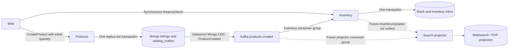
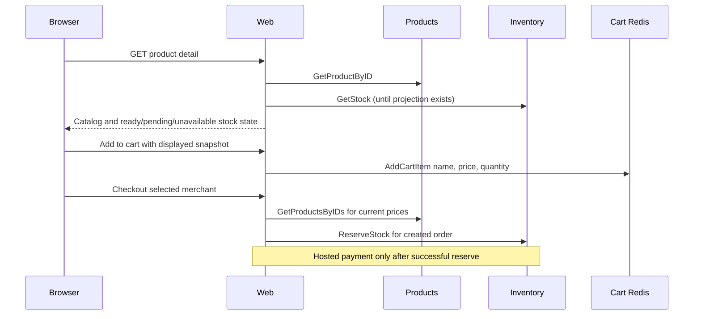

# Catalog, Inventory, and Search

Products persists listings and a ProductCreated outbox document in MongoDB; Debezium Mongo CDC publishes the topic inventory and the future Meilisearch projector consume independently. Meilisearch remains #7.

## Ownership

- Products owns listing identity, name, description, price, and merchant in Mongo `catalog.listings`. Requested initial quantity is creation intent carried in the event, not live catalog stock.
- Inventory Postgres owns available/reserved quantity, reservations, seed intent, inbox, and outbox. Web calls stock reads and ReserveStock; products never calls inventory.
- Cart Redis owns displayed product snapshots and requested cart quantities.
- Meilisearch is a future catalog/availability projection, never the checkout source of truth.

## Creation and durable publication

Web sends catalog fields and explicit non-negative initial quantity to CreateProduct. Missing quantity is invalid; explicit zero is valid. Products commits the listing and a `catalog_outbox` document atomically in a replica-set transaction. Debezium Mongo watches that collection and publishes ProductCreated to `products.created`, keyed by product id. Never save the listing and then rely on a separate best-effort Kafka publish from the products process.

The event contains a stable event id, schema version, occurrence time, product id, initial product version, catalog fields, and explicit initial quantity. Outbox retries retain the same event identity.

Inventory consumes the event in its own `inventory-product-created` group, separate from reservation/payment consumption, validates it, and commits inbox identity and initial stock in one transaction before acknowledging it. EnsureStock is internal inventory logic, not an RPC. Duplicate/replayed creation must never overwrite stock changed by reservations; conflicting seed intent is rejected. Transient failures remain retryable and do not delete the listing.



```mermaid
sequenceDiagram
  participant B as Browser
  participant W as Web
  participant P as Products
  participant D as Mongo catalog
  participant K as Kafka
  participant I as Inventory
  participant S as Future search projector
  B->>W: Create listing + explicit initial quantity
  W->>P: CreateProduct
  P->>D: Commit listing + ProductCreated atomically
  D-->>P: Committed
  P-->>W: Listing identity
  W-->>B: Listing created; availability processing
  D-->>K: CDC publishes ProductCreated
  par Inventory group
    K->>I: ProductCreated
    I->>I: Commit inbox + stock seed
  and Future projector group
    K->>S: ProductCreated
    S->>S: Index catalog fields; availability not yet assumed
  end
```

Broker or consumer downtime may delay stock readiness, but committed listing creation succeeds. Failed catalog/outbox persistence fails creation and rolls back both. There is no web stock-seeding call and no compensation delete.

## PDP, cart, and checkout

Until the projected read model exists, web may GetStock once on PDP. A missing row means initialization is pending, a transport failure means availability is unavailable, and an existing row with zero available quantity means out of stock. Do not collapse these into zero. Disable purchase controls while availability is pending or unavailable.

Add-to-cart copies the displayed name/price snapshot. Cart quantity changes reuse that snapshot and cart reads do not hydrate products or stock. Checkout re-batches products for authoritative prices and synchronously reserves inventory before creating hosted payment. A checkout that reaches inventory before initialization fails safely and does not open payment.



## Meilisearch follow-up (#7)

The projector consumes ProductCreated in a separate consumer group so inventory lag/replay does not affect indexing progress. It also needs InventoryUpdated with stock quantities and an inventory version; existing inventory.reserved/reservation_failed outcomes do not supply that snapshot.

Catalog and inventory events can arrive in either order. Retain stock updates that arrive before catalog data and merge them when catalog arrives. Apply monotonic catalog and inventory versions independently; a catalog update must not erase newer stock. Catalog creation alone must not mark a product in stock.

Before enabling a mutable production index, add catalog update/delete events and tombstones. This cutover establishes Mongo listings plus durable creation CDC; the search consumer, InventoryUpdated publisher/projection, and update/delete events remain follow-up work. Browse stays dark until #7.

## Deployment and verification

Products uses `mongodb-catalog-app` against `catalog-mongodb-svc`. Kafka Connect runs a Mongo outbox connector on `catalog.catalog_outbox` (same EventRouter identity, key, payload, and tracing fields as other outboxes) and must be allowed to Mongo 27017. Inventory keeps its CNPG cluster and Postgres outbox connector. Preserve event identity and tracing metadata. There is no `products-db` after cutover.
