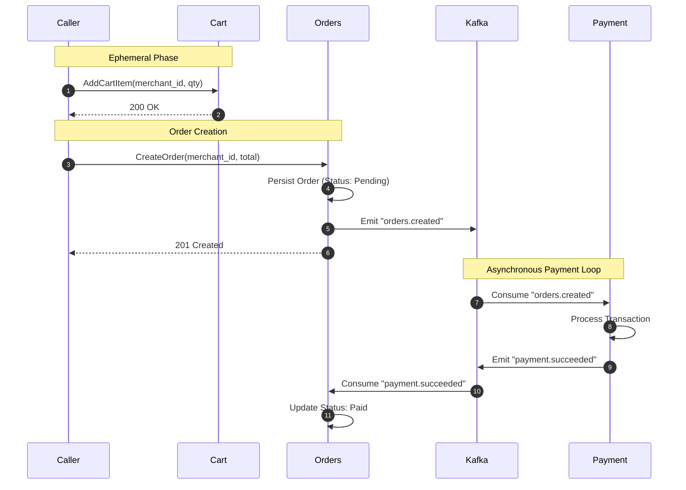

# Merchant-Scoped Order And Payment Flow

This document describes the current core contract between `cart`, `orders`, and `payment`.

## Core Model

- `cart` stores ephemeral cart state and requires caller-supplied `merchant_id` on item writes.
- `orders` accepts only merchant-scoped order creation requests.
- `payment` creates one payment transaction per order.
- Kafka events are order-level, not item-level.

## Flow

## Responsibilities

### Cart

- Stores `product_id`, `merchant_id`, and `quantity` in Redis/Valkey-backed state.
- Validates that `cart_id`, `product_id`, and `merchant_id` are present and UUID-shaped.
- Does not derive merchant ownership from `products`.

### Orders

- Persists one order per merchant.
- Stores `merchant_id` on the order record.
- Stores order items with `product_id`, `quantity`, `unit_price_cents`, and `line_total_cents`.
- Emits one `orders.created` outbox event per created order.
- Consumes `payment.succeeded` and `payment.failed` to update order status.

### Payment

- Stores payment intent by `order_id`.
- Consumes `orders.created`.
- Creates one payment transaction per `order_id`.
- Emits `payment.succeeded` or `payment.failed` through the payment outbox.

## Event Contracts

### `orders.created`

Produced by `orders` once per created order.

Carries:

- `order_id`
- `buyer_user_id`
- `merchant_id`
- `total_cents`

### `payment.succeeded` / `payment.failed`

Produced by `payment` once per payment transaction outcome.

Carries:

- `order_id`
