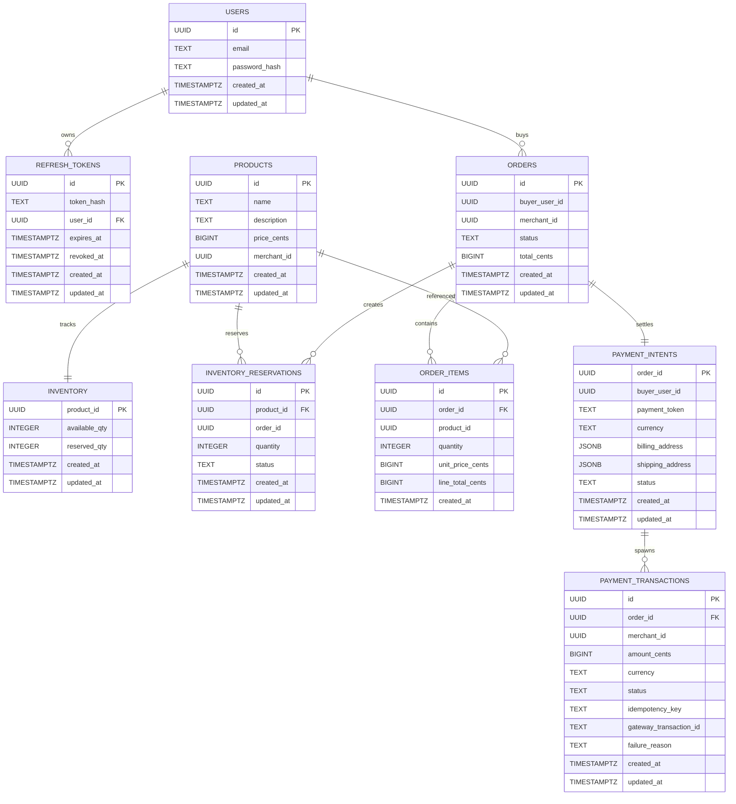

# Database Schema

Each domain service owns its local database schema. The `products` service now owns catalog rows, stock rows, and reservation rows under one boundary. Cross-service references are logical IDs, not shared foreign-key ownership. Redis/Valkey is used for ephemeral cart state.

The current core order and payment model is merchant-scoped:

- cart items carry caller-supplied `merchant_id`
- each order belongs to exactly one merchant
- payment creates one transaction per order
- Kafka contracts use `orders.created`, `payment.succeeded`, and `payment.failed`
- product creation requires explicit initial stock
- reservation state is tracked inside the catalog boundary, not in a standalone inventory service

