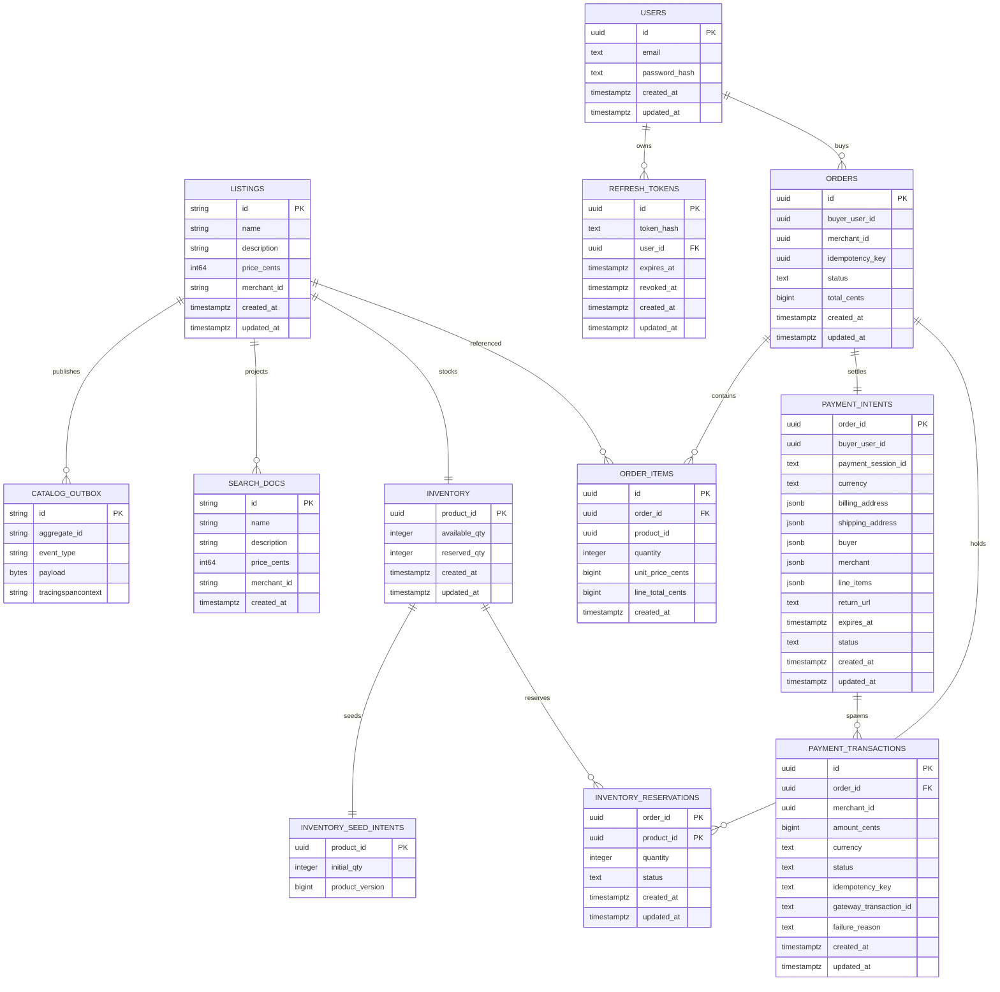

# Database schema

Each domain service owns its store. Cross-service references are logical IDs, not shared foreign keys. There is no products Postgres cluster after the catalog cutover.

| Owner     | Store                   | What it holds                                                    |
| --------- | ----------------------- | ---------------------------------------------------------------- |
| products  | MongoDB `catalog`       | `listings`, `catalog_outbox`                                     |
| search    | Meilisearch             | Catalog-field documents (projection)                             |
| inventory | Postgres `inventory_db` | Stock, reservations, seed intent, inbox, outbox                  |
| users     | Postgres `users_db`     | Users, refresh tokens                                            |
| orders    | Postgres `orders_db`    | Orders, items, inbox, outbox                                     |
| payment   | Postgres `payment_db`   | Hosted sessions (`payment_intents`), transactions, inbox, outbox |
| cart      | Redis/Valkey            | Ephemeral cart documents                                         |

Logical IDs: listing `_id` = inventory `product_id` = order item `product_id`. `merchant_id` is stored on listings, cart lines, and orders. Cart items also carry caller-supplied `product_name` and `unit_price_cents` snapshots.

```mermaid
erDiagram
  LISTINGS {
    string id PK
    string name
    string description
    int64 price_cents
    string merchant_id
    timestamptz created_at
    timestamptz updated_at
  }

  CATALOG_OUTBOX {
    string id PK
    string aggregate_id
    string event_type
    bytes payload
    string tracingspancontext
  }

  SEARCH_DOCS {
    string id PK
    string name
    string description
    int64 price_cents
    string merchant_id
    timestamptz created_at
  }

  USERS {
    uuid id PK
    text email
    text password_hash
    timestamptz created_at
    timestamptz updated_at
  }

  REFRESH_TOKENS {
    uuid id PK
    text token_hash
    uuid user_id FK
    timestamptz expires_at
    timestamptz revoked_at
    timestamptz created_at
    timestamptz updated_at
  }

  INVENTORY {
    uuid product_id PK
    integer available_qty
    integer reserved_qty
    timestamptz created_at
    timestamptz updated_at
  }

  INVENTORY_SEED_INTENTS {
    uuid product_id PK
    integer initial_qty
    bigint product_version
  }

  INVENTORY_RESERVATIONS {
    uuid order_id PK
    uuid product_id PK
    integer quantity
    text status
    timestamptz created_at
    timestamptz updated_at
  }

  ORDERS {
    uuid id PK
    uuid buyer_user_id
    uuid merchant_id
    uuid idempotency_key
    text status
    bigint total_cents
    timestamptz created_at
    timestamptz updated_at
  }

  ORDER_ITEMS {
    uuid id PK
    uuid order_id FK
    uuid product_id
    integer quantity
    bigint unit_price_cents
    bigint line_total_cents
    timestamptz created_at
  }

  PAYMENT_INTENTS {
    uuid order_id PK
    uuid buyer_user_id
    text payment_session_id
    text currency
    jsonb billing_address
    jsonb shipping_address
    jsonb buyer
    jsonb merchant
    jsonb line_items
    text return_url
    timestamptz expires_at
    text status
    timestamptz created_at
    timestamptz updated_at
  }

  PAYMENT_TRANSACTIONS {
    uuid id PK
    uuid order_id FK
    uuid merchant_id
    bigint amount_cents
    text currency
    text status
    text idempotency_key
    text gateway_transaction_id
    text failure_reason
    timestamptz created_at
    timestamptz updated_at
  }

  USERS ||--o{ REFRESH_TOKENS : owns
  USERS ||--o{ ORDERS : buys
  ORDERS ||--o{ ORDER_ITEMS : contains
  ORDERS ||--|| PAYMENT_INTENTS : settles
  PAYMENT_INTENTS ||--o{ PAYMENT_TRANSACTIONS : spawns
  LISTINGS ||--o{ CATALOG_OUTBOX : publishes
  LISTINGS ||--o{ SEARCH_DOCS : projects
  LISTINGS ||--|| INVENTORY : stocks
  INVENTORY ||--|| INVENTORY_SEED_INTENTS : seeds
  INVENTORY ||--o{ INVENTORY_RESERVATIONS : reserves
  ORDERS ||--o{ INVENTORY_RESERVATIONS : holds
  LISTINGS ||--o{ ORDER_ITEMS : referenced
```

Inbox/outbox tables (`inventory_inbox`, `inventory_outbox`, `orders_inbox`, `orders_outbox`, `payment_inbox`, `payment_outbox`) are CDC/idempotency machinery, not domain entities. Cart is a Redis document, not a SQL table.

Relationships that cross stores (listing → inventory, listing → search doc, listing → order item) are logical only.
