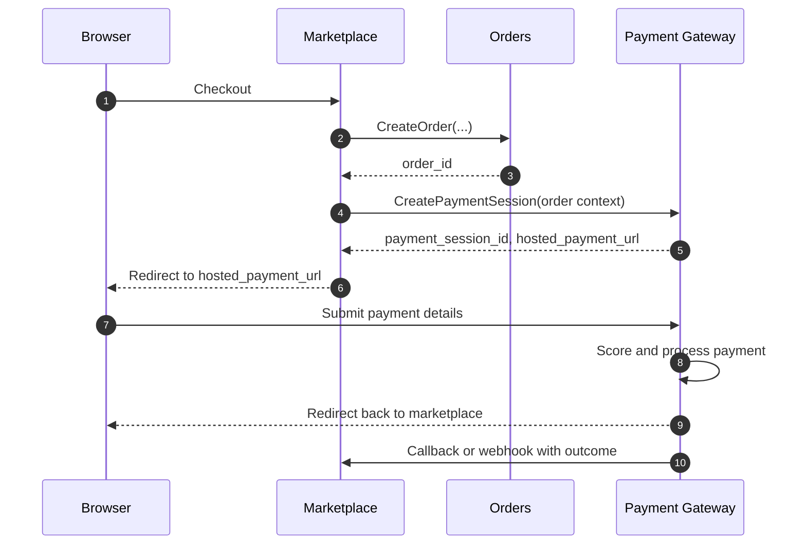

# Ecommerce Fraud Gateway Note

This note captures a simpler future direction for payment and fraud in the marketplace.

## Direction

Use a hosted payment page.

```text
Marketplace checkout -> create order -> create gateway payment session -> redirect user to gateway
```

That keeps payment entry and fraud logic out of the marketplace.

## Responsibility Split

### Marketplace

Owns commerce facts:

- buyer account
- seller account
- products and prices
- cart
- order
- shipping address chosen for the order

Sends only commerce context to the gateway.

### Payment Gateway

Owns payment execution and fraud logic:

- hosted payment page
- payment session lifecycle
- payment method capture or tokenization
- device and network signals
- fraud scoring and decisioning
- payment outcome callback to marketplace

The gateway may keep its own local customer and merchant records if useful, but those can be created lazily when a payment session is created. No separate customer or merchant sync flow is required for this plan.

### Feature Platform

Spark, Flink, or another feature system computes derived historical features such as:

- customer velocity
- average spend
- new device flags
- merchant risk rates
- IP or geo anomalies

This layer computes history. It should not own orders or payment execution.

## Runtime Flow



## Idempotency

`Model B` does not hurt idempotency if the boundary is defined simply.

- `order_id` is the idempotency key for payment-session creation.
- Repeating `CreatePaymentSession` for the same `order_id` should return the same active session.
- Refreshing the hosted payment page should not create a second payment attempt by itself.
- Gateway-side submission and gateway callbacks should also be idempotent.

If you later want retries after a failed payment, the gateway can support multiple attempts under the same `order_id` without creating duplicate live sessions.

## Marketplace To Gateway Contract

The marketplace should send the minimum necessary commerce facts.

### Request Sketch

```json
{
  "order_id": "6a7c...",
  "buyer": {
    "marketplace_user_id": "0a61...",
    "email": "buyer@example.com",
    "account_created_at": "2026-05-24T12:00:00Z"
  },
  "merchant": {
    "marketplace_merchant_id": "b2b8...",
    "category": "refurbished_electronics",
    "account_created_at": "2026-01-10T09:00:00Z"
  },
  "order": {
    "amount_cents": 25999,
    "currency": "USD",
    "item_count": 2,
    "items": [
      {
        "product_id": "p-1",
        "category": "smartphones",
        "quantity": 1,
        "unit_price_cents": 19999,
        "condition": "refurbished_grade_a"
      },
      {
        "product_id": "p-2",
        "category": "accessories",
        "quantity": 1,
        "unit_price_cents": 6000,
        "condition": "new"
      }
    ]
  },
  "shipping_address": {
    "name": "Buyer Name",
    "line1": "123 Main St",
    "line2": "Apt 4",
    "city": "New York",
    "region": "NY",
    "postal_code": "10001",
    "country": "US"
  },
  "redirect": {
    "return_url": "https://marketplace.example/orders/6a7c.../payment/return",
    "cancel_url": "https://marketplace.example/orders/6a7c.../payment/cancel"
  }
}
```

### Response Sketch

```json
{
  "payment_session_id": "ps_...",
  "hosted_payment_url": "https://gateway.example/pay/ps_...",
  "expires_at": "2026-05-24T12:20:00Z"
}
```

## Gateway Fraud Inputs

The gateway should combine three kinds of data.

### Commerce Facts From Marketplace

- `order_id`
- `marketplace_user_id`
- `marketplace_merchant_id`
- `amount_cents`
- `currency`
- `item_count`
- `product_categories[]`
- `shipping_country`
- `customer_account_created_at`
- `merchant_account_created_at`

### Runtime Signals Captured By Gateway

- `payment_session_id`
- `attempted_at`
- `ip_address`
- `ip_country`
- `asn`
- `user_agent`
- `device_fingerprint`
- `session_id`
- `payment_method_type`
- `payment_method_fingerprint`

### Derived Features From Feature Platform

- `customer_txn_count_24h`
- `customer_avg_amount_30d`
- `customer_new_device_flag`
- `customer_new_ip_flag`
- `device_distinct_customers_24h`
- `merchant_decline_rate_7d`

## Simulator Model

Treat this as ecommerce fraud, not physical terminal fraud.

Use these core simulated entities:

- customer profiles
- merchant profiles
- device profiles
- payment method profiles

Instead of customer-to-terminal distance, model customer familiarity:

- usual devices
- usual IP geographies
- usual shipping regions
- usual merchant categories

### Transaction Generation Outline

1. Generate customer profiles.
2. Generate merchant profiles.
3. Generate device and payment method profiles.
4. Associate customers with familiar devices, regions, and payment methods.
5. Generate legitimate transactions.
6. Apply fraud scenarios.

### Good Starting Fraud Scenarios

- stolen card on a new device
- account takeover from unusual geography
- reshipping mule address
- low-value card testing burst
- high-velocity retry attack

## Current System Gap

Today the repository still reflects an internal payment-intent shape based on:

- `order_id`
- `buyer_user_id`
- `payment_token`
- `currency`
- `shipping_address`

That is enough for the current internal payment flow, but not yet for a hosted gateway payment session with ecommerce fraud analysis.
