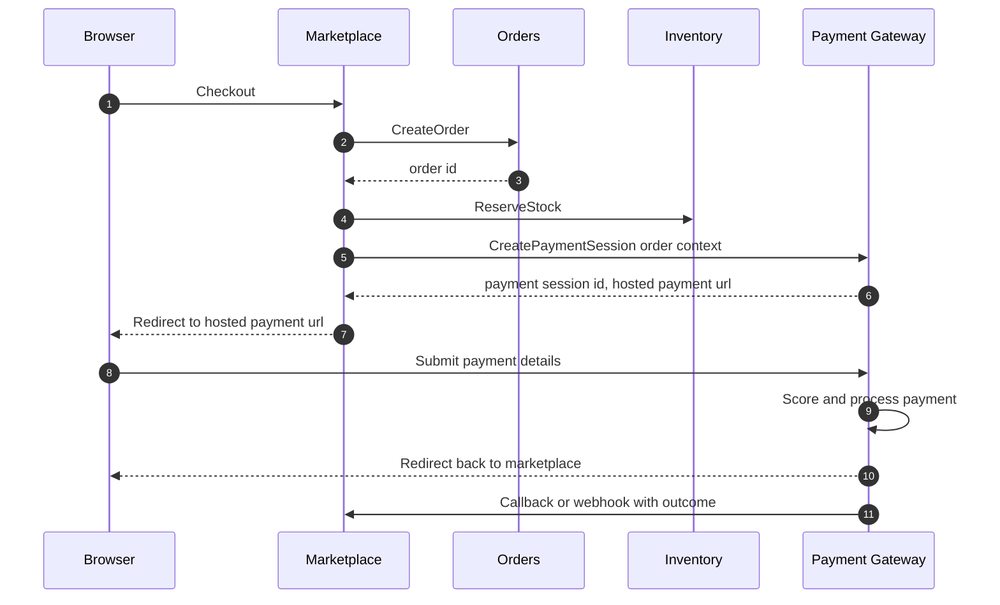

# Ecommerce fraud gateway note

Future direction for payment fraud. The marketplace already uses a hosted payment page (in-cluster simulator today). This note is about moving fraud scoring and card capture fully onto a real gateway plus an optional feature platform.

## Direction

```text
Marketplace checkout -> create order -> reserve stock -> create gateway payment session -> redirect user to gateway
```

That keeps payment-method entry and fraud decisioning out of marketplace services.

## Responsibility split

### Marketplace (current)

Owns commerce facts:

- buyer account
- seller account
- products and prices
- cart
- order
- shipping address chosen for the order
- inventory reservation before redirect

Sends commerce context to the gateway (`order_id` is the session idempotency key).

### Payment gateway (target)

Owns payment execution and fraud logic:

- hosted payment page
- payment session lifecycle
- payment method capture or tokenization
- device and network signals
- fraud scoring and decisioning
- payment outcome callback to marketplace

The gateway may keep its own local customer and merchant records if useful, created lazily when a payment session is created. No separate customer or merchant sync flow is required.

### Feature platform (not built)

Spark, Flink, or another feature system would compute derived historical features such as:

- customer velocity
- average spend
- new device flags
- merchant risk rates
- IP or geo anomalies

This layer computes history. It should not own orders or payment execution.

## Runtime flow


```mermaid
sequenceDiagram
    autonumber
    participant B as Browser
    participant M as Marketplace
    participant O as Orders
    participant I as Inventory
    participant G as Payment Gateway

    B->>M: Checkout
    M->>O: CreateOrder
    O-->>M: order id
    M->>I: ReserveStock
    M->>G: CreatePaymentSession order context
    G-->>M: payment session id, hosted payment url
    M-->>B: Redirect to hosted payment url
    B->>G: Submit payment details
    G->>G: Score and process payment
    G-->>B: Redirect back to marketplace
    G->>M: Callback or webhook with outcome
```

## Idempotency

- `order_id` is the idempotency key for payment-session creation.
- Repeating CreatePaymentSession for the same `order_id` returns the same active session.
- Refreshing the hosted payment page must not create a second payment attempt by itself.
- Gateway-side submission and gateway callbacks must also be idempotent.

Retries after a failed payment can stay under the same `order_id` without creating duplicate live sessions.

## Marketplace to gateway contract

Minimum commerce facts. This sketch is a target contract, not the current gRPC field list.

### Request sketch

```json
{
  "order_id": "6a7c...",
  "buyer": {
    "marketplace_user_id": "0a61...",
    "email": "buyer@example.com",
    "account_created_at": "2026-05-24T12:00:00Z"
  },
  "merchant": {
    "marketplace_merchant_id": "b2b8...",
    "category": "refurbished_electronics",
    "account_created_at": "2026-01-10T09:00:00Z"
  },
  "order": {
    "amount_cents": 25999,
    "currency": "USD",
    "item_count": 2,
    "items": [
      {
        "product_id": "p-1",
        "category": "smartphones",
        "quantity": 1,
        "unit_price_cents": 19999,
        "condition": "refurbished_grade_a"
      }
    ]
  },
  "shipping_address": {
    "name": "Buyer Name",
    "line1": "123 Main St",
    "city": "New York",
    "region": "NY",
    "postal_code": "10001",
    "country": "US"
  },
  "redirect": {
    "return_url": "https://marketplace.example/orders/6a7c.../payment/return"
  }
}
```

### Response sketch

```json
{
  "payment_session_id": "ps_...",
  "hosted_payment_url": "https://gateway.example/pay/ps_...",
  "expires_at": "2026-05-24T12:20:00Z"
}
```

Payment already persists hosted session metadata, buyer/merchant JSON snapshots, named line items, `return_url`, and `expires_at`. A real gateway would still need richer fraud inputs than that snapshot.

## Gateway fraud inputs

### Commerce facts from marketplace

- `order_id`
- `marketplace_user_id`
- `marketplace_merchant_id`
- `amount_cents`
- `currency`
- `item_count`
- `product_categories[]`
- `shipping_country`
- `customer_account_created_at`
- `merchant_account_created_at`

### Runtime signals captured by gateway

- `payment_session_id`
- `attempted_at`
- `ip_address`
- `ip_country`
- `asn`
- `user_agent`
- `device_fingerprint`
- `session_id`
- `payment_method_type`
- `payment_method_fingerprint`

### Derived features from feature platform

- `customer_txn_count_24h`
- `customer_avg_amount_30d`
- `customer_new_device_flag`
- `customer_new_ip_flag`
- `device_distinct_customers_24h`
- `merchant_decline_rate_7d`

## Simulator model

Treat this as ecommerce fraud, not physical terminal fraud.

Core simulated entities:

- customer profiles
- merchant profiles
- device profiles
- payment method profiles

Instead of customer-to-terminal distance, model customer familiarity: usual devices, IP geographies, shipping regions, and merchant categories.

### Transaction generation outline

1. Generate customer, merchant, device, and payment method profiles.
2. Associate customers with familiar devices, regions, and payment methods.
3. Generate legitimate transactions.
4. Apply fraud scenarios.

### Starting fraud scenarios

- stolen card on a new device
- account takeover from unusual geography
- reshipping mule address
- low-value card testing burst
- high-velocity retry attack

## Current gap

Hosted-session create, redirect, callback, expiry, and order-level `payment.succeeded` / `payment.failed` are implemented against `tools/payment-gateway-simulator`. What is not built:

- a real card-capturing gateway
- device/network signal collection
- fraud scoring
- a feature platform for historical risk features

Checkout still reserves inventory in-process before opening the hosted page; that marketplace rule stays even with an external gateway.
