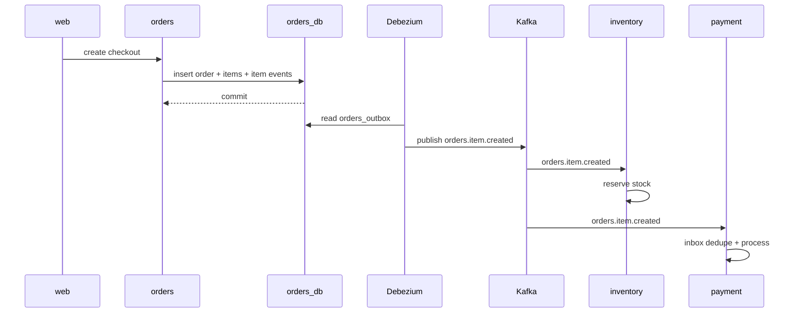

# Eventing Plan

## Goal

Use Kafka as the async backbone, but make event publishing reliable with outbox/inbox patterns.

## Outbox

- `orders` writes one outbox row per order item in the same db transaction.
- `payment` should do the same when introduced.
- The outbox row is the durable event source of truth.
- Keep the outbox table local to the service that owns the business change.

### `orders_outbox` Shape

- `id UUID PRIMARY KEY`
- `aggregate_id UUID NOT NULL` (`product_id` for item events)
- `event_type TEXT NOT NULL` (for example, `orders.item.created`)
- `payload JSONB NOT NULL`
- `created_at TIMESTAMPTZ NOT NULL DEFAULT NOW()`
- `published_at TIMESTAMPTZ NULL`
- `publish_attempts INT NOT NULL DEFAULT 0`

The shared event names live in `shared/messaging`.

### Transaction Flow

1. Start a db transaction.
2. Insert the order header.
3. Insert all order items.
4. Insert one outbox row per order item with the canonical item payload.
5. Commit the transaction.
6. A separate publisher/CDC process forwards the outbox rows to Kafka later.

### Event Payload

- Keep payload small and domain-focused.
- Include `order_id`, `order_item_id`, `product_id`, `merchant_id`, `buyer_user_id`, `quantity`, `unit_price_cents`, and `line_total_cents`.
- Do not include derived projections or transport-specific fields.

## CDC

- Use Debezium to stream outbox rows from Postgres into Kafka.
- Prefer CDC over custom polling for low-latency and fewer moving parts.
- Kafka topics should mirror domain event families, not application internals.

## Inbox

- Consumer services should store processed message IDs in a local inbox table.
- This prevents duplicate processing when Kafka redelivers a message.
- `inventory` and `payment` are likely consumers for inbox dedupe.

## Flow

1. `web` calls `orders`.
2. `orders` stores the order, items, and one outbox event per item in one transaction.
3. Debezium streams the outbox rows into Kafka.
4. `inventory` consumes the event and reserves stock keyed by `product_id`.
5. `payment` consumes the event and checks its inbox table before processing.
6. `payment` records success/failure and emits follow-up events as needed.

## Why This Matters

- Prevents lost events when a service crashes after a db write.
- Prevents double-processing on consumer retries.
- Keeps fraud/analytics consumers aligned with the source of truth.
