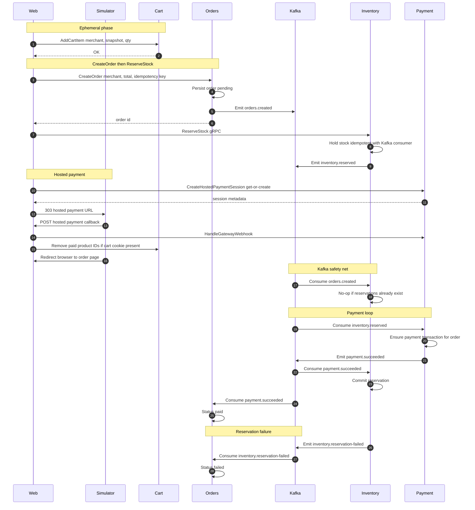

# Merchant-scoped order, inventory, and payment flow

Core contract between `cart`, `orders`, `inventory`, and `payment`, including the hosted-payment redirect used in development (and the in-cluster simulator).

## Core model

- `cart` stores ephemeral cart state and requires web-supplied `merchant_id`, `product_name`, and `unit_price_cents` on item writes.
- `orders` accepts only merchant-scoped order creation with a per-buyer `idempotency_key`.
- `web` calls inventory `ReserveStock` after `CreateOrder` returns, before hosted payment. Kafka `orders.created` is a safety net if gRPC already held stock.
- `payment` creates or reuses one hosted payment session per order and one payment transaction per order.

## Flow

```mermaid
sequenceDiagram
    autonumber
    participant WEB as Web
    participant SIM as Simulator
    participant CRT as Cart
    participant ORD as Orders
    participant K as Kafka
    participant INV as Inventory
    participant PAY as Payment

    Note over WEB,CRT: Ephemeral phase
    WEB->>CRT: AddCartItem merchant, snapshot, qty
    CRT-->>WEB: OK

    Note over WEB,ORD: CreateOrder then ReserveStock
    WEB->>ORD: CreateOrder merchant, total, idempotency key
    ORD->>ORD: Persist order pending
    ORD->>K: Emit orders.created
    ORD-->>WEB: order id
    WEB->>INV: ReserveStock gRPC
    INV->>INV: Hold stock idempotent with Kafka consumer
    INV->>K: Emit inventory.reserved

    Note over WEB,SIM: Hosted payment
    WEB->>PAY: CreateHostedPaymentSession get-or-create
    PAY-->>WEB: session metadata
    WEB->>SIM: 303 hosted payment URL
    SIM->>WEB: POST hosted payment callback
    WEB->>PAY: HandleGatewayWebhook
    WEB->>CRT: Remove paid product IDs if cart cookie present
    SIM->>WEB: Redirect browser to order page

    Note over K,INV: Kafka safety net
    K->>INV: Consume orders.created
    INV->>INV: No-op if reservations already exist

    Note over K,PAY: Payment loop
    K->>PAY: Consume inventory.reserved
    PAY->>PAY: Ensure payment transaction for order
    PAY->>K: Emit payment.succeeded
    K->>INV: Consume payment.succeeded
    INV->>INV: Commit reservation
    K->>ORD: Consume payment.succeeded
    ORD->>ORD: Status paid

    Note over K,ORD: Reservation failure
    INV->>K: Emit inventory.reservation-failed
    K->>ORD: Consume inventory.reservation-failed
    ORD->>ORD: Status failed
```

## Responsibilities

### Web

- Orchestrates browser checkout: `CreateOrder` with a checkout intent UUID, then inventory `ReserveStock`, then hosted payment redirect. If reserve fails, marks the order failed and does not redirect to pay.
- Does not drain the cart on checkout POST. After a successful hosted-payment callback (or paid order page), removes paid product IDs when a `cart_id` cookie is present.
- Resume payment on unpaid pending orders re-holds stock (idempotent `ReserveStock`) then reuses or refreshes the hosted session.
- Builds the buyer-facing hosted payment URL from payment session metadata and gateway configuration.
- Accepts hosted gateway callbacks and forwards terminal outcomes to `payment` over gRPC.

### Cart

- Stores `product_id`, `merchant_id`, `quantity`, `product_name`, and `unit_price_cents` in Redis/Valkey.
- Validates that `cart_id`, `product_id`, and `merchant_id` are present and UUID-shaped.
- Does not derive merchant ownership from products.

### Orders

- Accepts merchant-scoped PlaceOrder with required `idempotency_key` unique per buyer.
- Persists the order and emits one `orders.created` outbox event. Does not call products or inventory.
- Stores `merchant_id` on the order record.
- Stores order items with `product_id`, `quantity`, `unit_price_cents`, and `line_total_cents`.
- Consumes `inventory.reservation-failed`, `payment.succeeded`, and `payment.failed` to update order status.

### Inventory

- Stores aggregate stock in `inventory` and reservation ownership in inventory-local reservation records (composite key `order_id`, `product_id`).
- Consumes `orders.created` and reserves all order item lines idempotently per `order_id` if gRPC has not already held stock.
- Exposes `ReserveStock` and stock-read gRPC used by web.
- Emits `inventory.reserved` when the order is fully reserved.
- Emits `inventory.reservation-failed` when the order cannot be fully reserved.
- Consumes `payment.succeeded` and `payment.failed` to commit or release reserved stock.

### Payment

- Stores hosted payment session state by `order_id` (`payment_intents`) plus buyer/merchant snapshots and line items for the gateway page.
- Reuses `order_id` as the idempotency anchor for hosted session creation.
- Consumes `inventory.reserved` and does not insert a second payment transaction when hosted-session create already wrote one.
- Applies hosted gateway outcomes from the web edge and emits `payment.succeeded` or `payment.failed` through the payment outbox.
- Periodically expires PENDING hosted sessions past `expires_at` (default 30m TTL, sweep every 1m), marks them `EXPIRED`, and emits `payment.failed` so inventory releases reserved stock and orders move to failed. If the payment transaction does not exist yet, the expired intent is caught up when `inventory.reserved` creates the transaction.

### Simulator

- In-cluster hosted payment simulator under `tools/payment-gateway-simulator`.
- Renders a mock hosted payment page, posts a terminal callback to `services/web`, and redirects the browser back to the marketplace order page.

## Event contracts

### `orders.created`

Produced by `orders` once per created order.

Carries:

- `order_id`
- `buyer_user_id`
- `merchant_id`
- `total_cents`
- `items[]` with `product_id` and `quantity`

### `inventory.reserved`

Produced by `inventory` once per fully reserved order.

Carries:

- `order_id`
- `merchant_id`
- `total_cents`

### `inventory.reservation-failed`

Produced by `inventory` once per order that cannot be fully reserved.

Carries:

- `order_id`

### `payment.succeeded` / `payment.failed`

Produced by `payment` once per payment transaction outcome.

Carries:

- `order_id`
