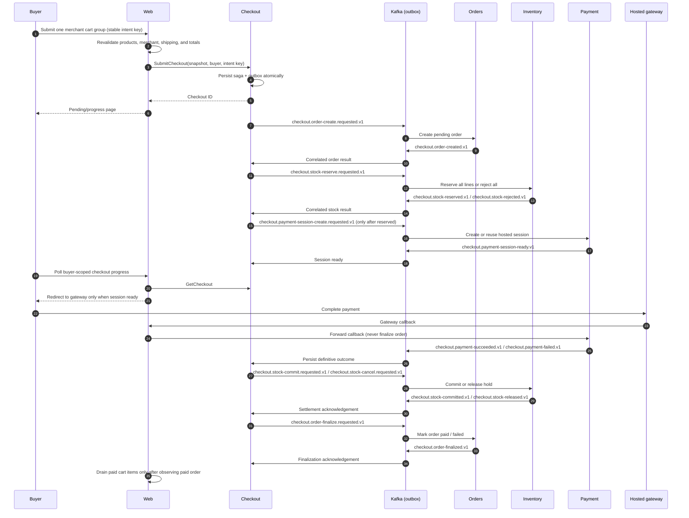

# Merchant-scoped checkout saga

Checkout is a durable, PostgreSQL-backed coordinator. Cart state is ephemeral; Orders owns orders, Inventory owns stock, and Payment owns hosted sessions and gateway outcomes. No buyer-facing service directly reserves checkout stock or creates a payment session.

## Flow

```mermaid
sequenceDiagram
    autonumber
    participant B as Buyer
    participant W as Web
    participant C as Checkout
    participant K as Kafka (outbox)
    participant O as Orders
    participant I as Inventory
    participant P as Payment
    participant G as Hosted gateway

    B->>W: Submit one merchant cart group (stable intent key)
    W->>W: Revalidate products, merchant, shipping, and totals
    W->>C: SubmitCheckout(snapshot, buyer, intent key)
    C->>C: Persist saga + outbox atomically
    C-->>W: Checkout ID
    W-->>B: Pending/progress page
    C->>K: checkout.order-create.requested.v1
    K->>O: Create pending order
    O->>K: checkout.order-created.v1
    K->>C: Correlated order result
    C->>K: checkout.stock-reserve.requested.v1
    K->>I: Reserve all lines or reject all
    I->>K: checkout.stock-reserved.v1 / checkout.stock-rejected.v1
    K->>C: Correlated stock result
    C->>K: checkout.payment-session-create.requested.v1 (only after reserved)
    K->>P: Create or reuse hosted session
    P->>K: checkout.payment-session-ready.v1
    K->>C: Session ready
    B->>W: Poll buyer-scoped checkout progress
    W->>C: GetCheckout
    W-->>B: Redirect to gateway only when session ready
    B->>G: Complete payment
    G->>W: Gateway callback
    W->>P: Forward callback (never finalize order)
    P->>K: checkout.payment-succeeded.v1 / checkout.payment-failed.v1
    K->>C: Persist definitive outcome
    C->>K: checkout.stock-commit.requested.v1 / checkout.stock-cancel.requested.v1
    K->>I: Commit or release hold
    I->>K: checkout.stock-committed.v1 / checkout.stock-released.v1
    K->>C: Settlement acknowledgement
    C->>K: checkout.order-finalize.requested.v1
    K->>O: Mark order paid / failed
    O->>K: checkout.order-finalized.v1
    K->>C: Finalization acknowledgement
    W->>W: Drain paid cart items only after observing paid order
```

If stock is rejected, Checkout compensates the pending order; the buyer never sees a payment page. A session timeout does not imply payment failed: Checkout requests cancellation/verification and retains uncertain outcomes for manual review rather than releasing stock while a charge might exist. An explicit gateway expiry callback is definitive: Payment records `EXPIRED` (distinct from a decline), reports a correlated result, and Checkout releases stock before failing the order. Late contradictory success is recorded as a financial exception.

## Ownership and retries

- **Checkout** stores the saga, inbox, outbox, deadlines, and exception records in PostgreSQL. It correlates each command/result to the checkout and retries durable due work after restarts.
- **Orders** creates and finalizes orders only on Checkout commands. An order remains pending until Checkout receives stock settlement acknowledgement and issues finalization.
- **Inventory** accepts Checkout reserve/cancel/commit commands, fences cancel-before-reserve with an order tombstone, and returns durable idempotent results. `orders.created` does not reserve stock.
- **Payment** accepts Checkout session-create/cancel commands, records gateway callback outcomes, and returns uncertain cancellation as uncertain. It does not create sessions from `inventory.reserved`.
- **Web** submits a validated snapshot once per intent, displays buyer-scoped progress, forwards gateway callbacks, and leaves cart items until payment succeeds. The legacy direct `POST /orders`, `ReserveStock`, `CreateOrder`, `UpdateOrderStatus`, and `CreateHostedPaymentSession` RPCs are removed.

All command and result topics are versioned `checkout.*.v1`. Each producer's Debezium connector publishes its own outbox rows; consumers use inbox deduplication. The Checkout database is the source of truth for recovery, not a Kafka consumer offset or a browser redirect. See `services/checkout/README.md` for states and reconciliation rules.

## Rollout gate

On **existing prod**, retain all legacy records and sessions. Apply Checkout, Orders, Inventory, and Payment migrations in place; verify Checkout, all four outbox connectors, and command/result consumers before relying on the new buyer flow. Exercise duplicates, unavailable stock, lost acknowledgement, failed/late payment, expiry, and worker restart only with isolated synthetic fixtures, without restarting shared production workers or disrupting buyers. Inspect the prod Checkout Saga dashboard for pending-age, compensation, stuck workflows, and unresolved financial exceptions; confirm every accepted synthetic checkout stays buyer-queryable. Do not wipe `ecommerce` or assume old records have been migrated or reconciled.
