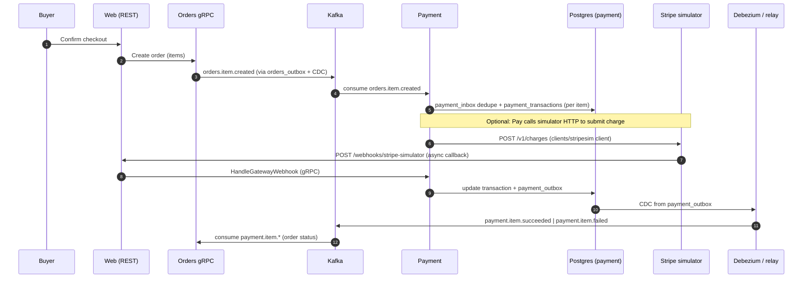
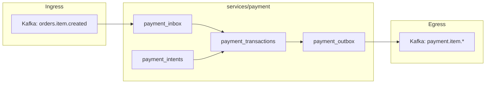

# Payment Service Plan

## Goal

Implement `services/payment` as the orchestrator between:

- async checkout intent (`orders.item.created`)
- an external Stripe-like gateway (future project)
- async webhook results
- reliable downstream events (`payment.item.*`)

## End-to-end flow (Mermaid)

## Transport Boundaries

- `web` owns the public REST surface:
  - `POST /webhooks/stripe-simulator` (webhook callback endpoint)
- `payment` is an internal gRPC service:
  - `InitiatePayment` (called by web on order confirmation)
  - `HandleGatewayWebhook` (called by web after receiving a webhook)
- `cmd/payment` starts a **Kafka consumer** (same code path as integration tests: `messaging.NewKafkaConsumer` + `service.KafkaOrdersItemCreatedHandler`) when **`KAFKA_BOOTSTRAP_SERVERS`** is set. If unset, only gRPC runs (e.g. minimal local runs without Kafka).

**Kafka env (`cmd/payment`):**

| Variable                  | Meaning                                                                                  |
| ------------------------- | ---------------------------------------------------------------------------------------- |
| `KAFKA_BOOTSTRAP_SERVERS` | Bootstrap list (e.g. `kafka:9092`). Empty → no consumer.                                 |
| `KAFKA_GROUP_ID`          | Consumer group (default `payment-service`).                                              |
| `KAFKA_PREFER_IPV4`       | Set `true` or `1` to pass `PreferIPv4` to the shared consumer (Docker Desktop / Colima). |

## Data Model (Postgres)

Migrations live in `services/payment/db/migrations/`.

- `payment_intents` (order-level intent captured at confirmation)
  - `order_id` (PK), `buyer_user_id`, `payment_token`, `currency`
  - `billing_address` JSONB, `shipping_address` JSONB
  - `status` (string state machine)
- `payment_transactions` (per order item)
  - `id` (PK), `order_id` (FK), `order_item_id` (unique)
  - `merchant_id`, `amount_cents`, `currency`
  - `status`, `idempotency_key` (unique)
  - `gateway_transaction_id`, `failure_reason`
- `payment_inbox`
  - `message_id` (PK), `received_at`
- `payment_outbox`
  - same shape as `orders_outbox`, published via Debezium

## Eventing

- Consume:
  - `orders.item.created` (per order item; produced by `orders_outbox` via Debezium)
- Emit (via `payment_outbox` + Debezium):
  - `payment.item.succeeded`
  - `payment.item.failed`

## Kafka Consumption (Go)

Use `refurbished-marketplace/shared/messaging` (`NewKafkaConsumer`, `KafkaHandler`, `KafkaMessage`) which wraps `confluent-kafka-go` with:

- **single poller goroutine** calling `Poll()`
- commit offsets only after the handler returns nil (inbox/state durable)

Integration tests can use `shared/testutil.SetupKafka(t)` (Kafka in Testcontainers, KRaft).

## Stripe Simulator Integration

- **HTTP client** for calling the simulator: [`clients/stripesim`](../../clients/stripesim/client.go) — `stripesim.New(baseURL)`, `CreateCharge` → `POST /v1/charges` with idempotency header.

Optional dev helper: a stub HTTP server that returns `202` for charges and triggers the webhook for fast local testing (e.g. under `cmd/` or beside the client).

## Tests

- `services/payment/tests/` — same style as `services/orders/tests` and `services/products/tests`.
- **Postgres** (`service_test.go`): `shared/testutil.SetupPostgresWithMigrations` + Goose on `services/payment/db/migrations`. Requires **Docker** (Testcontainers). Run: `go test ./tests/...`
- **Kafka** (`kafka_test.go`): uses `confluent-kafka-go`, which links **librdkafka** via CGO (on macOS this pulls in `-lsasl2`, etc.).
